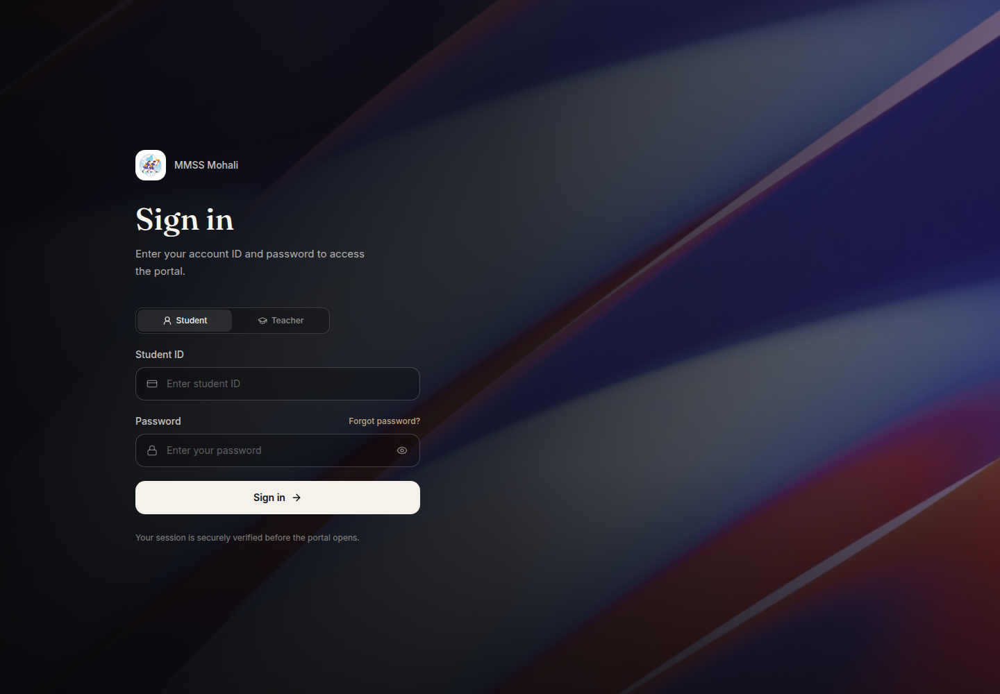

# 📚 MMSS Mohali — Student Portal & Homework Hub

> **A high-performance, calm, and modern student experience for MMSS Mohali.**  
> Track daily homework, access classwork files, request peer assistance, and chat with classmates — delivered with sub-second instant load times on web, mobile, and desktop.


---

## 🔗 Try the Live App

Open the deployed app at **[mmss64.vercel.app](https://mmss64.vercel.app)**.
The portal requires a valid MMSS student or teacher account. A private demo-teacher account is
enabled for reviewers; request its credentials separately rather than publishing the password.



## 🤖 AI Use Disclosure

The app uses OpenAI's **Moderation API** (`omni-moderation-latest`) to check text and uploaded
images in Messages, Requests, and Classwork for abusive, unsafe, or NSFW content. This is a
content-safety filter, not a chatbot or a homework-generation feature. Deterministic profanity
and file-type checks run locally as a second layer.

---

## ✨ Core Product Showcase

### ⚡ Sub-Second Instant Homework Engine
- **Instant Response (< 15ms)**: Powered by a Stale-While-Revalidate architecture and SQLite local persistence. Students never sit staring at a 10-second loading screen — homework renders immediately on launch.
- **Login Pre-parsing**: Background parser syncs school portal announcements during authentication so assignments are ready before the main view even opens.

### 📅 Smart Homework Diary
- **Subject Intelligence**: Automatic subject detection, color-coded badges, assignment status tracking, and date-range filtering.
- **Attachment Previews**: Inline file previews for images, PDF notes, and worksheets with auto-compression.
- **Smooth Pagination**: Infinite batch card loading with memory retention so browsing past weeks of homework remains butter-smooth.

### 💬 Classmate Messaging & Collaboration
- **Direct Peer Chat**: High-speed, section-based direct messaging with classmates.
- **Rich Media & Lightbox**: Send notes, images, and documents with built-in full-screen image lightbox view.
- **Unread Counter & Scroll Teleportation**: Real-time unread badges and sticky scroll teleport buttons for instant navigation to the latest message.

### 🤝 Section Help & Classwork Sharing
- **Help Requests**: Post and fulfill homework help requests with fellow section students.
- **Classwork Storage**: Upload, organize, and browse shared class notes by subject.

### 📱 Installable PWA Experience
- **Cross-Platform**: Install directly to home screen or desktop on **iOS (Safari)**, **Android (Chrome)**, and **Computer (Chrome / Edge / Safari)**.
- **High-Res Branding**: 1024x1024 vector crisp branding assets with squircle safe-zone padding for macOS Dock and mobile app grids.
- **Guided Setup**: Built-in interactive device installation guide with step-by-step instructions for every device.

### 🎨 Premium Design System
- **Dark & Light Modes**: Beautiful dark/light theme switching with automatic system preference detection.
- **Liquid Glass Aesthetics**: Modern Tailwind CSS v4 design system with smooth micro-animations, solid logo containers, and clean sans-serif typography.

---

## 🎨 Design & Experience Principles

- **Zero Monospace Clutter**: Enforces clean, high-legibility sans-serif typography across all views and modals.
- **Solid White Logo Wrappers**: Brand containers maintain solid white backing across light and dark themes for consistent contrast.
- **Indigo Accent Palette**: Styled with blue-sided Indigo (`#4f46e5`) accent colors for a focused, calm UI atmosphere.

---

## 🛠️ Architecture & Technology Stack

| Layer | Technology |
| :--- | :--- |
| **Frontend** | React 19, TypeScript 5.7, Vite 6 |
| **Styling** | Tailwind CSS v4, Lucide React, Phosphor Icons |
| **UI Components** | Radix UI, Base UI, DND Kit, Recharts |
| **Backend API** | Express 5 (Node.js), Cookie Authentication |
| **Database** | SQLite, LibSQL, Drizzle ORM |
| **Security** | HTTP-Only Cookies, Helmet, CORS, Rate Limiters |

---

## 🚀 Developer & Local Setup

<details>
<summary><strong>Click to expand installation and development setup instructions</strong></summary>

### Prerequisites
- Node.js v18+ & npm v9+

### Quick Start
```bash
# 1. Clone the repo
git clone https://github.com/Leviathan0x0/homework-fetcher.git
cd homework-fetcher

# 2. Install dependencies
npm install

# 3. Start development servers
npm start      # Start backend API (Terminal 1)
npm run dev    # Start frontend Vite server (Terminal 2)
```

Open `http://localhost:5173` in your browser.

### NPM Commands
- `npm run dev`: Launch Vite dev server
- `npm run build`: Build production assets
- `npm start`: Launch Express server

</details>

---

## 📄 License

Distributed under the **ISC License**. See `package.json` for details.
